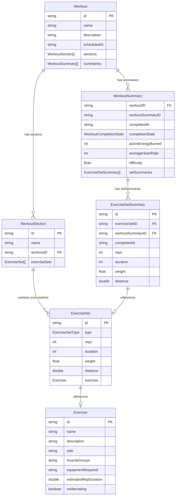

# Android Engineering Project - Exercise Progress

In this project, we've set up a realistic scenario of the type of feature development we'd do here at Future. We'd like you to do the brainstorming, planning, building, and presenting. Basically, we're attempting to create a compressed microcosm of working at Future!

Please take 2 hours to work on the project (excluding any time reading this document + formulating a plan). Please feel free to reach out to us to ask questions and engage us for assistance where needed before and during the project.

Afterwards, you’ll sit with the team and lead a 30-minute discussion around the progress you made, how you thought about the problem & solution, and what you might do if given more time.

We are much more interested in how you were thinking about the problem and solution than the polish and completeness of your work – just make as much progress as you can given the time you have.

## Problem Statement

Future coaches often look at athletic performance (such as weight lifted) over time for a client as an indication of progress towards a specific goal.

We’d like you to construct a simple app that shows this information about a single client based on their recorded workout data. This app should have:

- A way to select a specific exercise completed by the client.
- A way to see the historical performance data.

It’s up to you how to organize and present this information as long as it meets these requirements.

## Data Model Architecture

This is a Entity Relationship Diagram of the data models we use to store workout data. We only show some of more important fields for brevity, but feel free to use any other fields you need.

## Project Details

We’ve provided a basic Android project skeleton with a data set with workout data for the client, and the corresponding models and loading functions in Kotlin so you can get started quickly.

The final output should be an app that runs in an Android emulator, written in Kotlin. You’re free to use any other tools or libraries that you are comfortable with.

After the project period, we’d like you to present to the team about what you built, so save a few minutes at the end to collect your thoughts. We’ll also want to see the work that you did along the way!

## Agentic Coding

We want you to use AI coding agents like Claude Code, Codex, Cursor for this project — they're part of how we work here. If you use one, please follow these guidelines:

- Include all the configuration / rules you used to guide the AI Coding Agents (CLAUDE.md, skills, etc.)
- Include a short paragraph of your workflow and tools used
- We expect submissions completed with aid of AI coding agents to still be well understood by you.
- Be prepared to walk us through the process you followed — how you broke down the problem, what you asked the agent for, and where you stepped in yourself
- Have your project set up and ready to modify if you proceed to a live take-home review, so we can explore changes together

## If You're Having Fun

Totally optional, but we love seeing a screen recording walkthrough of the app.

## Submit

- GitHub repo (if private — share access with `travischapman`)

